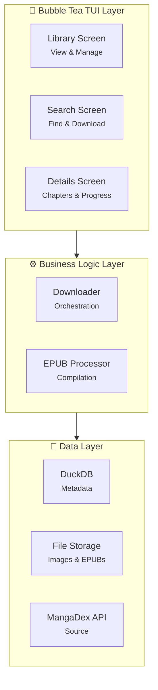

# Manga Bookshelf CLI

A beautiful terminal-based manga downloader and library manager that fetches manga from MangaDex and compiles entire series into EPUB files.

## ✨ Features

- 📚 **Beautiful TUI** - Built with Bubble Tea and Lip Gloss for a polished terminal experience
- 🔍 **Search** - Find manga from MangaDex with full-text search
- 📥 **Download** - Download entire manga series with progress tracking
- 📖 **EPUB Generation** - Compile all chapters into a single, properly formatted EPUB file
- 💾 **Local Library** - Store manga metadata in DuckDB
- 🎨 **Styled Interface** - Color-coded status indicators and beautiful card layouts

## 🚀 Quick Start

### Installation

```bash
# Build the binary
go build -o bin/mangas cmd/main.go

# Or run directly
go run cmd/main.go
```

### Usage

**Launch TUI (default):**
```bash
mangas
```

**Search for manga:**
```bash
mangas search Naruto
```

**Add manga to library:**
```bash
mangas add "Naruto"
```

**List manga in library:**
```bash
mangas list
```

**Download manga chapters:**
```bash
# Download all chapters
mangas download "Naruto" --language en

# Download specific chapter range
mangas download "Naruto (2002)" --language en --chapters 1-10
```

**Generate EPUB from downloaded chapters:**
```bash
mangas epub <manga-id>
```

For complete CLI documentation, see [CLI.md](CLI.md).

## 🎮 TUI Controls

### Library View
- `↑/k` `↓/j` - Navigate manga list
- `enter` - View manga details
- `e` - Generate EPUB for selected manga
- `d` - Delete manga from library
- `r` - Refresh library
- `tab` - Switch to Search view
- `q` - Quit

### Search View
- Type to search MangaDex
- `enter` - Search (when focused on input) or Download (when focused on results)
- `esc` - Toggle focus between input and results
- `↑/k` `↓/j` - Navigate search results
- `tab` - Switch to Library view
- `q` - Quit

### Details View
- `↑/k` `↓/j` - Navigate chapters
- `e` - Generate EPUB
- `r` - Refresh
- `esc/backspace` - Return to library
- `q` - Quit

## 📁 File Locations

All data is stored in `~/.mangas/`:
- `~/.mangas/mangas.db` - DuckDB database (metadata)
- `~/.mangas/downloads/{manga_id}/{chapter_id}/` - Downloaded manga images
- `~/.mangas/library/` - Generated EPUB files

## 🏗️ Architecture



## 📦 Repository Structure

```
mangas/
├── bin/
│   └── mangas              # Compiled binary
├── cmd/                    # CLI entry point
│   ├── main.go             # Entry point (package main)
│   └── mangas/             # Command implementations (package cmd)
│       ├── root.go         # Root command + TUI launcher
│       ├── list.go         # List library (bubbles/table)
│       ├── search.go       # Search MangaDex (bubbles/table)
│       ├── add.go          # Add manga to library
│       ├── download.go     # Download chapters
│       ├── epub.go         # Generate EPUB
│       └── helpers.go      # Shared utilities
├── pkg/
│   ├── app/
│   │   ├── app.go          # App initialization
│   │   ├── components/     # Reusable UI components (Bubbles)
│   │   │   ├── mangalist.go    # Manga list with cards
│   │   │   └── progress.go     # Download progress tracker
│   │   ├── screens/        # TUI screens (Bubble Tea)
│   │   │   ├── root.go         # Main coordinator
│   │   │   ├── library.go      # Library view
│   │   │   ├── search.go       # Search view (with textinput)
│   │   │   └── details.go      # Manga details
│   │   └── styles/
│   │       └── theme.go        # Lipgloss styling
│   ├── data/
│   │   ├── model.go            # Data models
│   │   └── duckdb.go           # Database repository
│   ├── integrations/
│   │   ├── interface.go        # Processor interface
│   │   └── epub.go             # EPUB generation
│   ├── services/
│   │   └── downloader.go       # Download orchestration
│   └── sources/
│       ├── interface.go        # Source interface
│       ├── mangadex.go         # MangaDex API
│       └── local.go            # Local source
├── go.mod
├── go.sum
└── README.md
```

## 🛠️ Technical Stack

### Charm Bracelet Suite (Consistent Throughout)
- **TUI Framework**: [Bubble Tea](https://github.com/charmbracelet/bubbletea) - Interactive TUI
- **Styling**: [Lip Gloss](https://github.com/charmbracelet/lipgloss) - Terminal styling
- **Components**: [Bubbles](https://github.com/charmbracelet/bubbles) - UI components
  - `textinput` - Search input field
  - `table` - CLI table formatting

### Core Dependencies
- **Database**: [DuckDB](https://duckdb.org/) via [go-duckdb](https://github.com/marcboeker/go-duckdb)
- **EPUB**: [go-epub](https://github.com/go-shiori/go-epub)
- **CLI**: [Cobra](https://github.com/spf13/cobra)
- **API Source**: [MangaDex API](https://api.mangadex.org/docs/)

## 📝 Development

### Build
```bash
make build
# or
go build -o bin/mangas cmd/main.go
```

### Test
```bash
make test
# or
go test ./...
```

### Test Coverage
```bash
make coverage
# Generates coverage report showing 81.5% coverage for core packages
```

### Generate HTML Coverage Report
```bash
make coverage-html
# Opens coverage.html in your browser
```

### Clean Dependencies
```bash
go mod tidy
```

## 🧪 Testing

We maintain **81.5% test coverage** for core business logic packages:
- **Data Layer**: 80.5% coverage
- **Integrations**: 89.9% coverage  
- **Sources**: 89.1% coverage
- **UI Components**: 94.2% coverage

See [TESTING.md](TESTING.md) for detailed testing documentation.

## 🌟 Features in Detail

### Download Flow
1. Search for manga on MangaDex
2. Select manga and initiate download
3. Downloads all chapters (filtered by language, default: English)
4. Stores images locally in organized directories
5. Updates DuckDB with metadata and download status
6. Generates single EPUB containing all chapters

### EPUB Generation
- Chapters sorted by volume and number
- Proper XHTML structure
- Navigation table of contents (NCX/NAV)
- Embedded metadata (title, author, description)
- High-quality image embedding
- Compatible with most EPUB readers

## 📄 License

See project license file.

## 🤝 Contributing

Contributions are welcome! Please feel free to submit a Pull Request.