# Manga Bookshelf CLI

## Architecture

```mermaid
graph TD
    subgraph UI["🎨 Bubble Tea TUI Layer"]
        List[List View<br/><small>Filtering</small>]
        View[Detail View<br/><small>Reading</small>]
        Download[Download View<br/><small>Progress Tracking</small>]
    end
    
    subgraph Logic["⚙️ Business Logic Layer"]
        Serivce[Manga Service]
        Manager[Downloader]
        Library[Library Manager]
    end
    
    subgraph Data["💾 Data Layer"]
        db[DuckDB<br/><small>Metadata</small>]
        file[File Storage<br/><small>.cbz/.epub</small>]
        API[Sources<br/><small>MangaDx API</small>]
    end

    UI --> Logic
    Logic --> Data
```



## Repo Structure

```
mangas
├── bin
│   └── mangas                  # cli output binary
├── cmd
│   └── main.go                 # cobra entrypoint
├── docs                        # documentation
├── pkg
│   ├── app                     # bubble tea ui layer
│   │   ├── app.go              # app entrypoint
│   │   ├── components          # ui components
│   │   │   ├── filter.go       
│   │   │   ├── mangalist.go    
│   │   │   └── progress.go     
│   │   ├── screens             # tui screens modules
│   │   │   ├── details.go
│   │   │   ├── library.go
│   │   │   ├── root.go         # root screen
│   │   │   └── search.go
│   │   └── styles              # tui style definitions
│   │       └── theme.go        # theme
│   ├── data                    # data storage layer
│   │   ├── duckdb.go           # duckdb
│   │   ├── migrations          # migrations
│   │   └── model.go            # data models
│   ├── integrations            # manga storage formatters
│   │   ├── cbz.go              # cbz formatter
│   │   ├── epub.go             # epub formatter
│   │   └── interface.go        
│   ├── services                # business layer logic
│   │   └── downloader.go       # downloader manager
│   └── sources                 # manga sources layer
│       ├── interface.go        
│       ├── local.go            
│       └── mangadex.go         # mangadex source
├── README.md                     
├── go.mod 
├── go.sum
```